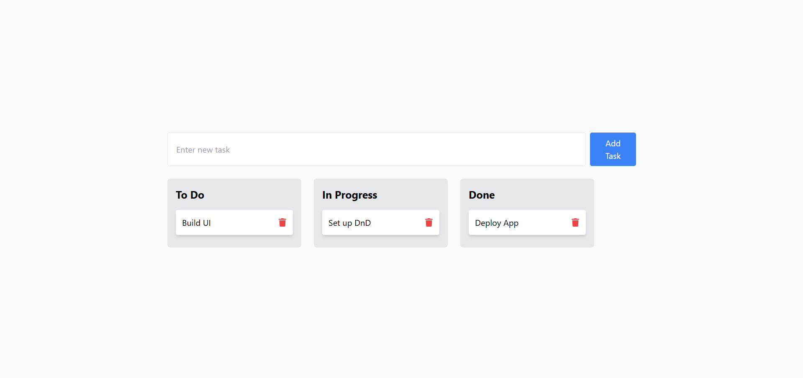

Here's a README file for your **Drag & Drop Task Manager** project:

---

# Drag & Drop Task Manager 🗂️💻

A task management app with drag-and-drop functionality, built using **React**, **React DnD**, and **Tailwind CSS**. This project allows you to easily organize tasks into different statuses, such as "To Do", "In Progress", and "Done", with a clean and responsive UI.

---

## 🌐 Live Demo

Check out the live site: [Drag & Drop Task Manager](https://react-drag-and-drop-rana.netlify.app/)

---

## 🛠️ Tech Stack

- **React**: A JavaScript library for building user interfaces.
- **React DnD**: A library for handling drag-and-drop interactions.
- **Tailwind CSS**: A utility-first CSS framework for rapid UI development.

---

## 📸 Preview

 <!-- Update with your preview image URL -->

---

## 🚀 Features

- **Drag & Drop Functionality**: Easily drag tasks between different columns.
- **Task Deletion**: Remove tasks by clicking the trash icon.
- **Responsive Design**: Works well on devices of all screen sizes.
- **Modern UI**: Styled with Tailwind CSS for a clean, modern design.
- **State Management**: Uses React Context API for managing task states.

---

## 🧑‍💻 Installation & Setup

Follow these steps to run the project locally:

1. Clone the repository:

   ```bash
   git clone https://github.com/deveRana/100-Projects-react-js-ts-nextjs-nodejs.git
   ```

2. Navigate to the project directory:

   ```bash
   cd drag-and-drop-task-manager
   ```

3. Install the dependencies:

   ```bash
   npm install
   ```

4. Start the development server:

   ```bash
   npm start
   ```

5. Open your browser and visit:
   ```bash
   http://localhost:3000
   ```

---

## 💡 Inspiration

This project was inspired by the need for a simple, drag-and-drop task management app that can be easily customized and used in real-world applications. It's a great way to learn about drag-and-drop functionality in React and the use of React Context API.

---

Feel free to fork the repository and make improvements or modifications! 😄

---

Let me know if you'd like any changes or additional details!
